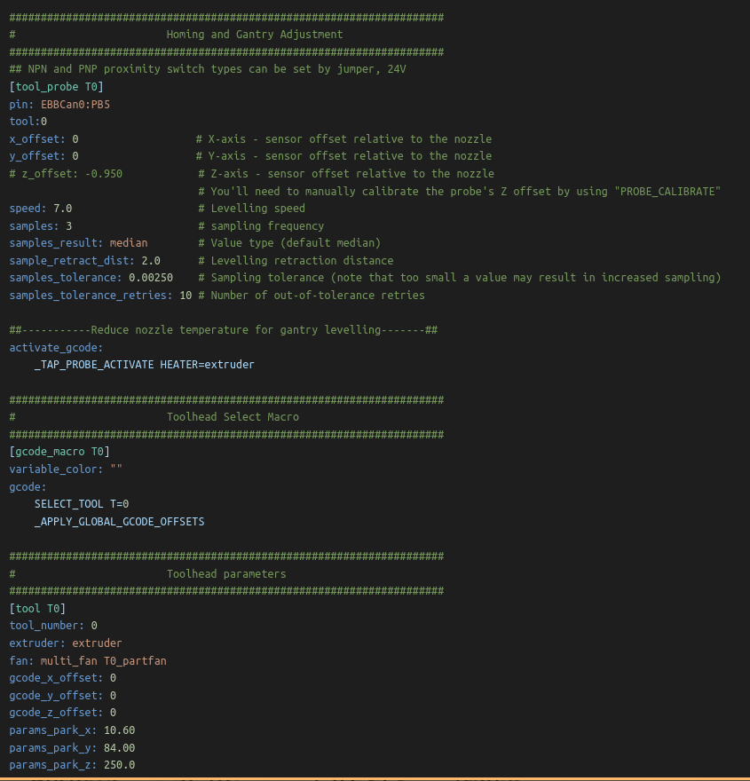
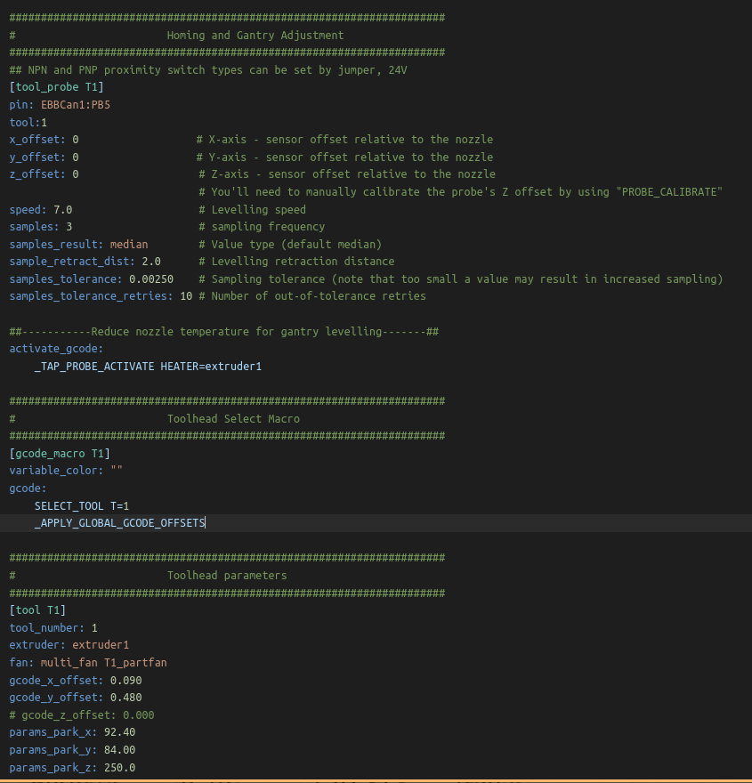

# Global Baby Stepping

Note: This current macro has only been tested on the creator's machine.

## Introduction

These macros enable the use of a global offset setting for all toolhead for baby stepping; which does not work with the default command, as it gets reset after tool change. It also left room for potential per-tool-head offsets.

These macro replace the stock `SET_GCODE_OFFSET` and `SAVE_CONFIG`. However, the default setting can still be trigger by using `_SET_GCODE_OFFSET` and `_SAVE_CONFIG`.

`SAVE_CONFIG` is now restricted such that you can only do it when the toolhead is on T0. However, the printer does not need to be homed for it, as you can just manually put T0 on the gantry.

The `SET_GCODE_OFFSET` will requires you to add the `_APPLY_GLOBAL_GCODE_OFFSETS` to all of your toolhead macros (T0, T1, etc.). In addition, the absolute offset changes function is left as stock. This is because absolute offset change, like `SET_GCODE_OFFSET X=0.5 Y=1.0 Z=0.75`,  are often used for automation and can lead to unintended behaviours for configs that are not custom made. 

